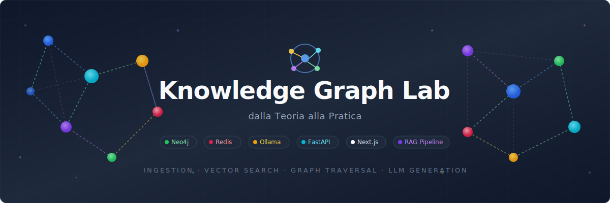

# Knowledge Graph Lab

<p align="center">
  
</p>

Sistema completo di **Knowledge Graph** con pipeline di ingestion, vector store, graph database, pipeline RAG e interfaccia web.
Progetto companion del libro _"Knowledge Graph: dalla Teoria alla Pratica"_ (Hevolus Srl, 2026).

---

## Indice

- [Architettura](#architettura)
- [Stack tecnologico](#stack-tecnologico)
- [Requisiti di sistema](#requisiti-di-sistema)
- [Quick start](#quick-start)
- [Avvio in sviluppo (senza Docker)](#avvio-in-sviluppo-senza-docker)
- [Avvio con Docker](#avvio-con-docker)
- [Struttura del repository](#struttura-del-repository)
- [API Reference](#api-reference)
- [UI (Frontend)](#ui-frontend)
- [Variabili d'ambiente](#variabili-dambiente)
- [Debug con VS Code](#debug-con-vs-code)
- [Test e linting](#test-e-linting)
- [Pipeline di ingestion](#pipeline-di-ingestion)
- [Pipeline RAG (query)](#pipeline-rag-query)
- [Modelli dati](#modelli-dati)
- [Riferimenti scientifici](#riferimenti-scientifici)
- [Troubleshooting](#troubleshooting)

---

## Architettura

```
                        +------------------+
                        |    Browser       |
                        |  localhost:3000   |
                        +--------+---------+
                                 |
                        +--------v---------+
                        |   Next.js UI     |
                        | (knowledge-graph |
                        |      -ui)        |
                        +--------+---------+
                                 | fetch / SSE
                        +--------v---------+
                        |   FastAPI API    |
                        | (knowledge-graph |
                        |      -api)       |
                        |  localhost:8000   |
                        +--+-----+------+--+
                           |     |      |
              +------------+  +--+--+  ++-----------+
              |               |     |               |
     +--------v------+ +-----v---+ +------v--------+
     | Neo4j 5.18    | | Redis   | | Ollama        |
     | Graph DB      | | Stack   | | llama3 +      |
     | :7474 / :7687 | | :6379   | | nomic-embed   |
     +---------------+ | :8001   | | :11434        |
                       +---------+ +---------------+
```

Il flusso dati segue due percorsi principali:

1. **Ingestion**: documento -> chunking -> embedding (Ollama) -> dedup (SHA-256) -> entity/relation extraction (LLM) -> storage in Redis (vettori) + Neo4j (grafo)
2. **Query RAG**: domanda -> intent classification -> vector search (Redis) -> graph traversal (Neo4j) -> context assembly -> LLM generation (Ollama) -> risposta

---

## Stack tecnologico

| Componente              | Tecnologia                               | Versione    |
| ----------------------- | ---------------------------------------- | ----------- |
| **Graph Database**      | Neo4j (Cypher + APOC)                    | 5.18        |
| **Vector Store**        | Redis for AI (RedisSearch + RedisJSON)   | latest      |
| **LLM Inference**       | Ollama (locale, no API key)              | latest      |
| **LLM Model**           | Llama 3                                  | latest      |
| **Embedding Model**     | nomic-embed-text (768 dim)               | latest      |
| **REST API**            | FastAPI + uvicorn                        | 0.111+      |
| **Modelli dati**        | Pydantic v2 + pydantic-settings          | 2.7+        |
| **Frontend**            | Next.js + React + Tailwind CSS           | 15 / 19 / 4 |
| **Graph Visualization** | react-force-graph-2d                     | 1.26+       |
| **Logging**             | structlog (JSON in prod, console in dev) | 24.1+       |
| **Testing**             | pytest + pytest-asyncio + pytest-mock    | 8.2+        |
| **Linting**             | ruff (API), ESLint + next lint (UI)      | 0.4+        |
| **Containerizzazione**  | Docker + Docker Compose                  | 24+ / v2    |

---

## Requisiti di sistema

- **Docker 24+** e Docker Compose v2
- **8 GB RAM** raccomandati (Ollama + Neo4j + Redis)
- **Python 3.11+** (solo per sviluppo locale API senza Docker)
- **Node.js 22+** (solo per sviluppo locale UI senza Docker)
- GPU NVIDIA opzionale (per accelerare Ollama)

---

## Quick start

Il modo piu rapido per avviare tutto:

```bash
# 1. Clona e posizionati nella root
git clone <repo-url>
cd knowledge-graph

# 2. Configura le variabili d'ambiente
cp .env.example .env
# Modifica NEO4J_PASSWORD e altri valori in .env

# 3. Avvia tutti i servizi
docker compose up --build -d

# 4. Scarica i modelli Ollama (solo la prima volta)
docker compose exec ollama ollama pull llama3
docker compose exec ollama ollama pull nomic-embed-text

# 5. (Opzionale) Popola con dati di esempio
cd knowledge-graph-api && make seed

# 6. Apri il browser
#    UI:           http://localhost:3000
#    API Swagger:  http://localhost:8000/docs
#    Neo4j:        http://localhost:7474
#    RedisInsight:  http://localhost:8001
```

---

## Avvio in sviluppo (senza Docker)

Per sviluppare con hot-reload su entrambi i progetti, avvia solo l'infrastruttura con Docker e i server di sviluppo nativamente.

### 1. Infrastruttura (Neo4j + Redis + Ollama)

```bash
cd knowledge-graph
docker compose up neo4j redis ollama -d
```

Attendi che i servizi siano healthy:

```bash
docker compose ps
```

### 2. Modelli Ollama (solo la prima volta)

```bash
docker compose exec ollama ollama pull llama3
docker compose exec ollama ollama pull nomic-embed-text
```

### 3. API (FastAPI)

```bash
cd knowledge-graph-api

# Crea e attiva virtualenv
python -m venv venv
source venv/bin/activate        # Linux/macOS
# venv\Scripts\activate         # Windows

# Installa dipendenze
pip install -r requirements.txt

# Avvia con hot-reload
uvicorn api.main:app --reload --port 8000
```

L'API sara disponibile su `http://localhost:8000`. La documentazione Swagger interattiva su `http://localhost:8000/docs`.

### 4. UI (Next.js)

```bash
cd knowledge-graph-ui

# Configura env
cp .env.local.example .env.local
# Verifica che NEXT_PUBLIC_API_URL=http://localhost:8000

# Installa dipendenze
npm install

# Avvia dev server
npm run dev
```

La UI sara disponibile su `http://localhost:3000`.

---

## Avvio con Docker

### Produzione

```bash
cp .env.example .env
# Configura .env con password reali

docker compose up --build -d
```

Servizi esposti:

| Servizio      | URL                         | Descrizione           |
| ------------- | --------------------------- | --------------------- |
| UI            | http://localhost:3000       | Frontend Next.js      |
| API           | http://localhost:8000       | REST API FastAPI      |
| API Docs      | http://localhost:8000/docs  | Swagger UI            |
| API ReDoc     | http://localhost:8000/redoc | ReDoc                 |
| Neo4j Browser | http://localhost:7474       | Interfaccia web Neo4j |
| RedisInsight  | http://localhost:8001       | Interfaccia web Redis |
| Ollama        | http://localhost:11434      | API Ollama            |

### Sviluppo (con hot-reload)

```bash
docker compose -f docker-compose.yml -f docker-compose.dev.yml up --build
```

Questa configurazione:

- Monta i sorgenti come volumi (modifiche applicate automaticamente)
- Abilita `--reload` su uvicorn per l'API
- Esegue `npm run dev` per la UI
- Imposta `DEBUG=true` e `LOG_LEVEL=DEBUG`

### Comandi utili

```bash
# Stato dei servizi
docker compose ps

# Log di un servizio specifico
docker compose logs -f api
docker compose logs -f ui

# Ferma tutto
docker compose down

# Ferma e rimuovi volumi (ATTENZIONE: cancella dati Neo4j/Redis)
docker compose down -v

# Rebuild di un singolo servizio
docker compose up --build api -d
```

### GPU NVIDIA (opzionale)

Per abilitare l'accelerazione GPU su Ollama, decommenta la sezione `deploy` nel servizio `ollama` di `docker-compose.yml`:

```yaml
ollama:
  # ...
  deploy:
    resources:
      reservations:
        devices:
          - driver: nvidia
            count: all
            capabilities: [gpu]
```

---

## Struttura del repository

```
knowledge-graph/
├── .vscode/                        # Configurazione VS Code (debug, tasks, settings)
│   ├── launch.json                 # Debug configurations
│   ├── tasks.json                  # Build/run tasks
│   └── settings.json               # Editor settings
├── docker-compose.yml              # Stack completo (prod)
├── docker-compose.dev.yml          # Override per sviluppo (hot-reload)
├── .env.example                    # Template variabili d'ambiente
│
├── knowledge-graph-api/            # Backend API (Python / FastAPI)
│   ├── api/                        # FastAPI app, routes, schemas
│   │   ├── main.py                 # Entrypoint applicazione
│   │   ├── schemas.py              # Pydantic request/response models
│   │   └── routes/
│   │       ├── ingest.py           # POST /ingest
│   │       └── query.py            # POST /query, POST /query/stream
│   ├── config/
│   │   └── settings.py             # Configurazione centralizzata (pydantic-settings)
│   ├── models/                     # Modelli di dominio
│   │   ├── base.py                 # VectorDocument
│   │   ├── graph_node.py           # GraphNode (KGNode)
│   │   └── relation.py             # Relation
│   ├── pipeline/                   # Pipeline di ingestion
│   │   ├── chunker.py              # Text chunking con overlap
│   │   ├── content_extractor.py    # PDF, DOCX, TXT extraction
│   │   ├── embedder.py             # Embedding via Ollama
│   │   ├── extractor.py            # Entity/relation extraction via LLM
│   │   ├── ingest.py               # Orchestratore pipeline
│   │   └── router.py               # MIME type routing
│   ├── query/                      # Pipeline di query
│   │   ├── vector_search.py        # KNN search in Redis
│   │   ├── graph_traversal.py      # Neighbor traversal in Neo4j
│   │   └── rag_pipeline.py         # Orchestratore RAG completo
│   ├── storage/                    # Backend di persistenza
│   │   ├── neo4j_graph.py          # Async Neo4j driver
│   │   └── redis_vector.py         # RedisSearch vector store
│   ├── utils/
│   │   ├── logger.py               # structlog configuration
│   │   └── helpers.py              # SHA-256 hash utility
│   ├── tests/                      # Test suite
│   ├── scripts/                    # Seed e demo scripts
│   ├── infra/docker/Dockerfile     # Dockerfile API
│   ├── requirements.txt
│   └── Makefile
│
└── knowledge-graph-ui/             # Frontend (Next.js / React)
    ├── src/
    │   ├── app/
    │   │   ├── layout.tsx          # Root layout con Navbar
    │   │   ├── page.tsx            # Dashboard (health + quick links)
    │   │   ├── query/page.tsx      # Pagina Search/Query
    │   │   └── graph/page.tsx      # Pagina Graph View
    │   ├── components/
    │   │   ├── Navbar.tsx           # Barra di navigazione
    │   │   ├── HealthStatus.tsx     # Indicatori salute servizi
    │   │   ├── QueryForm.tsx        # Form di ricerca RAG
    │   │   ├── QueryResults.tsx     # Visualizzazione risultati
    │   │   └── GraphView.tsx        # Visualizzazione grafo interattiva
    │   └── lib/
    │       └── api-client.ts        # Client API tipizzato (typed fetch wrapper)
    ├── Dockerfile                   # Multi-stage build (standalone)
    ├── .env.local.example
    ├── next.config.ts
    ├── package.json
    ├── tsconfig.json
    └── postcss.config.mjs
```

---

## API Reference

L'API espone una documentazione OpenAPI interattiva generata automaticamente da FastAPI:

- **Swagger UI**: http://localhost:8000/docs
- **ReDoc**: http://localhost:8000/redoc
- **OpenAPI JSON**: http://localhost:8000/openapi.json

### Endpoints

#### `GET /health` — Health Check

Verifica la connettivita con Neo4j, Redis e Ollama.

**Risposta** (`HealthResponse`):

```json
{
  "status": "healthy",
  "neo4j": true,
  "redis": true,
  "ollama": true
}
```

Il campo `status` e `"healthy"` se tutti i servizi sono raggiungibili, `"degraded"` altrimenti.

---

#### `POST /ingest` — Ingestion documento

Carica un documento, lo processa attraverso la pipeline completa (chunking, embedding, entity extraction) e lo persiste in Redis e Neo4j.

**Request Body** (`IngestRequest`):

```json
{
  "file_path": "/path/to/document.pdf",
  "thread_id": "my-project",
  "skip_existing": true
}
```

| Campo           | Tipo    | Default    | Descrizione                                      |
| --------------- | ------- | ---------- | ------------------------------------------------ |
| `file_path`     | string  | _required_ | Percorso del file da processare (PDF, DOCX, TXT) |
| `thread_id`     | string  | _required_ | Namespace per isolamento multi-tenant            |
| `skip_existing` | boolean | `true`     | Salta chunk gia presenti (dedup via SHA-256)     |

**Risposta** (`IngestResult`):

```json
{
  "document_id": "a1b2c3d4-...",
  "chunks_processed": 15,
  "chunks_skipped": 0,
  "entities_extracted": 23,
  "relations_extracted": 18,
  "nodes_created": 23,
  "edges_created": 18,
  "processing_time_ms": 12450.5,
  "errors": []
}
```

**Formati supportati**: `.pdf` (pypdf), `.docx` (python-docx), `.txt` (plain text).

---

#### `POST /query` — Query RAG (sincrona)

Esegue una query RAG ibrida: ricerca vettoriale + traversal del grafo + generazione LLM.

**Request Body** (`QueryRequest`):

```json
{
  "query": "Quali tecnologie sono collegate a Neo4j?",
  "thread_id": "my-project",
  "top_k": 10,
  "max_hops": 2
}
```

| Campo       | Tipo    | Default    | Descrizione                               |
| ----------- | ------- | ---------- | ----------------------------------------- |
| `query`     | string  | _required_ | Domanda in linguaggio naturale            |
| `thread_id` | string  | _required_ | Namespace dei dati da interrogare         |
| `top_k`     | integer | `10`       | Numero di risultati vettoriali            |
| `max_hops`  | integer | `2`        | Profondita massima di traversal nel grafo |

**Risposta** (`RAGResponse`):

```json
{
  "answer": "Neo4j e collegato a...",
  "sources": [
    {
      "doc_id": "chunk-uuid",
      "text_preview": "Prime 200 caratteri del chunk...",
      "score": 0.876
    }
  ],
  "nodes_used": ["node-id-1", "node-id-2"],
  "edges_used": ["NodeA --USES--> NodeB"],
  "query_intent": "entity_query",
  "processing_time_ms": 3200.0
}
```

Il campo `query_intent` puo essere: `document_query`, `entity_query`, `relation_query`, `general`.

---

#### `POST /query/stream` — Query RAG (streaming SSE)

Stessa request di `/query`, ma la risposta e uno stream di Server-Sent Events. Ogni token del LLM viene inviato come evento:

```
data: Neo4j
data:  e
data:  collegato
data:  a...
data: [DONE]
```

In caso di errore: `data: [ERROR] messaggio`.

---

#### `DELETE /documents/{document_id}` — Cancellazione documento

Elimina un documento e tutti i relativi chunk da Redis.

**Risposta**:

```json
{
  "deleted": "a1b2c3d4-..."
}
```

---

## UI (Frontend)

La UI e una Single Page Application basata su Next.js 15 (App Router) con tre pagine principali.

### Dashboard (`/`)

- Stato in tempo reale dei servizi (Neo4j, Redis, Ollama) con indicatori colorati
- Link rapidi alle pagine funzionali
- Accesso diretto a Swagger, Neo4j Browser, RedisInsight

### Search / Query (`/query`)

- Form di ricerca con parametri configurabili (thread_id, top_k, max_hops)
- Supporto streaming: i token appaiono in tempo reale durante la generazione
- Visualizzazione strutturata dei risultati: risposta, sources con score, metadata (intent, nodi, archi, tempo)

### Graph View (`/graph`)

- Input query per esplorare porzioni del knowledge graph
- Visualizzazione interattiva forze-direzionate (react-force-graph-2d)
- Nodi colorati per tipo, archi con frecce e label delle relazioni
- Zoom, pan e drag interattivi

### Client API tipizzato

Il file `src/lib/api-client.ts` funge da **contratto unico** tra UI e API:

- Interfacce TypeScript che replicano i modelli Pydantic dell'API
- Funzioni tipizzate per ogni endpoint (`getHealth`, `postQuery`, `postIngest`, `deleteDocument`)
- Generatore asincrono `streamQuery()` per gestire lo streaming SSE
- Supporto `AbortSignal` per cancellazione delle richieste

### Configurazione UI

Copia `.env.local.example` in `.env.local`:

```bash
cd knowledge-graph-ui
cp .env.local.example .env.local
```

| Variabile                       | Default                 | Descrizione                      |
| ------------------------------- | ----------------------- | -------------------------------- |
| `NEXT_PUBLIC_API_URL`           | `http://localhost:8000` | URL base dell'API                |
| `NEXT_PUBLIC_ENABLE_STREAMING`  | `true`                  | Abilita/disabilita SSE streaming |
| `NEXT_PUBLIC_ENABLE_GRAPH_VIEW` | `true`                  | Feature flag per la vista grafo  |

---

## Variabili d'ambiente

Tutte le variabili sono definite in `.env.example` nella root. Copia in `.env` e personalizza:

```bash
cp .env.example .env
```

### Neo4j

| Variabile        | Default             | Descrizione                                         |
| ---------------- | ------------------- | --------------------------------------------------- |
| `NEO4J_URI`      | `bolt://neo4j:7687` | URI di connessione (usa `localhost` per dev locale) |
| `NEO4J_USER`     | `neo4j`             | Username                                            |
| `NEO4J_PASSWORD` | `yourpassword`      | **Da cambiare** in produzione                       |
| `NEO4J_DATABASE` | `neo4j`             | Nome database                                       |

### Redis

| Variabile          | Default              | Descrizione                                            |
| ------------------ | -------------------- | ------------------------------------------------------ |
| `REDIS_URL`        | `redis://redis:6379` | URL di connessione (usa `localhost` per dev locale)    |
| `REDIS_INDEX_NAME` | `kg_vectors`         | Nome dell'indice vettoriale                            |
| `REDIS_VECTOR_DIM` | `768`                | Dimensione dei vettori (dipende dal modello embedding) |

### Ollama

| Variabile                | Default               | Descrizione                                              |
| ------------------------ | --------------------- | -------------------------------------------------------- |
| `OLLAMA_BASE_URL`        | `http://ollama:11434` | URL del servizio Ollama (usa `localhost` per dev locale) |
| `OLLAMA_LLM_MODEL`       | `llama3`              | Modello per generazione testo                            |
| `OLLAMA_EMBEDDING_MODEL` | `nomic-embed-text`    | Modello per embedding (768 dim)                          |

### Chunking

| Variabile       | Default | Descrizione                                  |
| --------------- | ------- | -------------------------------------------- |
| `CHUNK_SIZE`    | `1024`  | Dimensione massima di ogni chunk (caratteri) |
| `CHUNK_OVERLAP` | `128`   | Overlap tra chunk consecutivi (caratteri)    |

### Applicazione

| Variabile   | Default | Descrizione                                  |
| ----------- | ------- | -------------------------------------------- |
| `LOG_LEVEL` | `INFO`  | Livello di log (DEBUG, INFO, WARNING, ERROR) |
| `DEBUG`     | `false` | Modalita debug                               |

> **Nota**: per sviluppo locale senza Docker, le variabili `NEO4J_URI`, `REDIS_URL` e `OLLAMA_BASE_URL` devono usare `localhost` invece dei nomi dei container Docker.

---

## Debug con VS Code

Apri la cartella `knowledge-graph/` in VS Code. La directory `.vscode/` contiene configurazioni pronte.

### Estensioni raccomandate

- [Python](https://marketplace.visualstudio.com/items?itemName=ms-python.python) (ms-python.python)
- [Ruff](https://marketplace.visualstudio.com/items?itemName=charliermarsh.ruff) (charliermarsh.ruff)
- [Prettier](https://marketplace.visualstudio.com/items?itemName=esbenp.prettier-vscode) (esbenp.prettier-vscode)
- [JavaScript Debugger](https://marketplace.visualstudio.com/items?itemName=ms-vscode.js-debug) (built-in)

### Configurazioni di debug (launch.json)

| Nome                       | Tipo     | Cosa fa                                                                          |
| -------------------------- | -------- | -------------------------------------------------------------------------------- |
| **API: FastAPI (debugpy)** | Python   | Avvia uvicorn con debugger Python, hot-reload, punta a `localhost` per i servizi |
| **UI: Next.js (Server)**   | Node     | Avvia `npm run dev` e apre Chrome con debugger attivo                            |
| **UI: Next.js (Chrome)**   | Chrome   | Si attacca a un server Next.js gia in esecuzione su :3000                        |
| **API: Tests (pytest)**    | Python   | Esegue pytest con debugger per step-through dei test                             |
| **Full Stack: API + UI**   | Compound | Avvia API + UI in parallelo con un solo click                                    |

### Workflow consigliato

1. Avvia l'infrastruttura: `docker compose up neo4j redis ollama -d`
2. In VS Code, seleziona **"Full Stack: API + UI"** nel pannello Run and Debug
3. Premi `F5` — si avviano API (porta 8000) e UI (porta 3000) con debugger attivi
4. Imposta breakpoint nel codice Python (API) o TypeScript (UI)
5. Apri `http://localhost:3000` nel browser

### Tasks (tasks.json)

Accessibili da `Terminal > Run Task...`:

| Task                    | Comando                                   |
| ----------------------- | ----------------------------------------- |
| Docker Compose Up       | `docker compose up --build -d`            |
| Docker Compose Down     | `docker compose down`                     |
| Docker Compose Up (Dev) | `docker compose -f ... -f ... up --build` |
| API: Dev Server         | `uvicorn api.main:app --reload`           |
| UI: Dev Server          | `npm run dev`                             |
| API: Run Tests          | `pytest tests/ -v`                        |
| API: Lint               | `ruff check .`                            |
| Pull Ollama Models      | `ollama pull llama3 + nomic-embed-text`   |

---

## Test e linting

### API (Python)

```bash
cd knowledge-graph-api

# Esegui tutti i test
pytest tests/ -v

# Esegui un test specifico
pytest tests/test_ingest.py -v -k "test_name"

# Linting
ruff check .

# Auto-fix
ruff check . --fix
```

I test usano mock per Neo4j, Redis e Ollama — non servono i servizi attivi.

### UI (TypeScript)

```bash
cd knowledge-graph-ui

# ESLint
npm run lint
```

### Makefile targets (dal folder API)

```bash
cd knowledge-graph-api
make test       # pytest -v
make lint       # ruff check .
make install    # pip install -r requirements.txt
make run        # uvicorn --reload
make seed       # python scripts/seed_data.py
make demo       # python scripts/demo_query.py
```

---

## Pipeline di ingestion

La pipeline di ingestion (`POST /ingest`) processa un documento in 8 stadi:

```
Documento
    |
    v
[1] File Routing -----> Identificazione MIME type (PDF / DOCX / TXT)
    |
    v
[2] Content Extraction -> Testo grezzo + conteggio pagine
    |
    v
[3] Text Chunking -----> Chunk da 1024 char con overlap di 128
    |                     (rispetta confini di frase)
    v
[4] Embedding ---------> Vettori 768-D via Ollama (nomic-embed-text)
    |
    v
[5] Deduplication -----> Hash SHA-256 per saltare chunk duplicati
    |
    v
[6] Entity Extraction -> LLM estrae entita (Person, Technology, ...)
    |                     e relazioni (USES, PART_OF, ...)
    v
[7] Vector Storage ----> Upsert in Redis (RedisSearch + RedisJSON)
    |
    v
[8] Graph Storage -----> Nodi e archi in Neo4j (MERGE/upsert)
```

### Tipi di entita supportati

Person, Organization, Product, Technology, Process, Event, Location, Concept, Document, Category, Tag

### Tipi di relazione supportati

BELONGS_TO, RELATES_TO, CREATED_BY, MENTIONS, PART_OF, USES, LOCATED_IN, OCCURRED_AT, HAS_TAG, SIMILAR_TO, DEPENDS_ON, REPLACED_BY

---

## Pipeline RAG (query)

La pipeline RAG (`POST /query`) risponde a domande in 5 stadi:

```
Domanda utente
    |
    v
[1] Intent Classification -> Tipo: document_query | entity_query
    |                                relation_query | general
    v
[2] Vector Search ---------> Top-K documenti per similarita coseno
    |                         (Redis KNN)
    v
[3] Graph Enrichment ------> Traversal dei vicini fino a max_hops
    |                         (Neo4j Cypher)
    v
[4] Context Assembly ------> Prompt di sistema con chunk + nodi + archi
    |
    v
[5] LLM Generation -------> Risposta (sync o streaming SSE)
```

La ricerca e **ibrida**: combina similarita semantica (vettoriale) con relazioni strutturali (grafo) per produrre risposte piu complete e contestualizzate.

---

## Modelli dati

### VectorDocument (Redis)

Ogni chunk di un documento viene salvato in Redis come JSON con indice vettoriale:

| Campo              | Tipo       | Descrizione                      |
| ------------------ | ---------- | -------------------------------- |
| `id`               | UUID       | Identificativo univoco del chunk |
| `thread_id`        | string     | Namespace/partizione             |
| `text`             | string     | Contenuto testuale del chunk     |
| `name`             | string     | Nome del file sorgente           |
| `vector`           | float[768] | Embedding del chunk              |
| `content_hash`     | string     | SHA-256 per deduplicazione       |
| `base_document_id` | string     | ID del documento padre           |
| `mime_type`        | string     | Tipo MIME del file originale     |
| `page_number`      | integer    | Numero di pagina (per PDF)       |

### GraphNode (Neo4j)

Ogni entita estratta viene salvata come nodo nel grafo:

| Campo              | Tipo     | Descrizione                    |
| ------------------ | -------- | ------------------------------ |
| `id`               | UUID     | Identificativo univoco         |
| `name`             | string   | Nome dell'entita               |
| `label`            | string   | Etichetta di visualizzazione   |
| `node_type`        | string   | Tipo (Person, Technology, ...) |
| `namespace`        | string   | Namespace/partizione           |
| `importance`       | float    | Score 0-1                      |
| `confidence`       | float    | Score 0-1                      |
| `source_chunk_ids` | string[] | Riferimenti ai chunk sorgente  |

### Relation (Neo4j)

Ogni relazione estratta diventa un arco nel grafo:

| Campo           | Tipo   | Descrizione                    |
| --------------- | ------ | ------------------------------ |
| `id`            | UUID   | Identificativo univoco         |
| `source_id`     | string | Nodo sorgente                  |
| `target_id`     | string | Nodo destinazione              |
| `relation_type` | string | Tipo (USES, PART_OF, ...)      |
| `weight`        | float  | Forza della relazione 0-1      |
| `confidence`    | float  | Confidenza dell'estrazione 0-1 |

---

## Riferimenti scientifici

Il progetto si ispira alle seguenti pipeline e paper:

| Paper / Tool                       | Utilizzo nel progetto                                      |
| ---------------------------------- | ---------------------------------------------------------- |
| **OpenIE6** (Kolluru et al., 2020) | Pattern per estrazione triple open-domain                  |
| **CoDe-KG** (Anuyah et al., 2025)  | Pipeline modulare: coreference + decomposition + RE        |
| **KGGen** (Mo et al., 2025)        | Entity clustering/dedup per ridurre sparsita del grafo     |
| **BLINK** (Wu et al., 2019)        | Architettura bi-encoder + cross-encoder per entity linking |
| **DocRED** (Yao et al., 2019)      | Benchmark per relation extraction a livello documento      |

Architettura ibrida raccomandata dai paper: **Graph DB** (Neo4j/Cypher) per struttura + **Vector DB** (Redis/FAISS) per similarita semantica, con possibilita di indici vettoriali direttamente in Neo4j (`CREATE VECTOR INDEX`).

---

## Troubleshooting

### Ollama non si avvia o non risponde

```bash
# Verifica lo stato
docker compose logs ollama

# Se il container e up ma i modelli non sono scaricati
docker compose exec ollama ollama list
docker compose exec ollama ollama pull llama3
docker compose exec ollama ollama pull nomic-embed-text
```

La prima query dopo il pull dei modelli puo essere lenta (~30s) per il caricamento in memoria.

### Neo4j healthcheck fallisce

```bash
# Verifica i log
docker compose logs neo4j

# Verifica che la password corrisponda
echo $NEO4J_PASSWORD  # deve corrispondere al valore in .env
```

### L'API risponde "degraded" al health check

Significa che uno o piu servizi backend non sono raggiungibili. Controlla quali servizi hanno `false`:

```bash
curl http://localhost:8000/health
```

Verifica che i container siano running: `docker compose ps`

### La UI non si connette all'API

Verifica che `NEXT_PUBLIC_API_URL` sia impostata correttamente in `.env.local`:

- Dev locale: `http://localhost:8000`
- Docker: `http://localhost:8000` (il browser chiama l'API direttamente)
- Se API e UI sono su host diversi: configurare CORS sull'API (attualmente `allow_origins=["*"]`)

### Errori di memoria

Lo stack completo richiede circa 6-8 GB di RAM. Se Docker ha limiti inferiori:

```bash
# Controlla l'uso di memoria
docker stats

# Riduci caricando un modello Ollama piu leggero
# o disabilita APOC se non necessario
```

### Reset completo dei dati

```bash
# ATTENZIONE: cancella tutti i dati!
docker compose down -v
docker compose up --build -d
```
